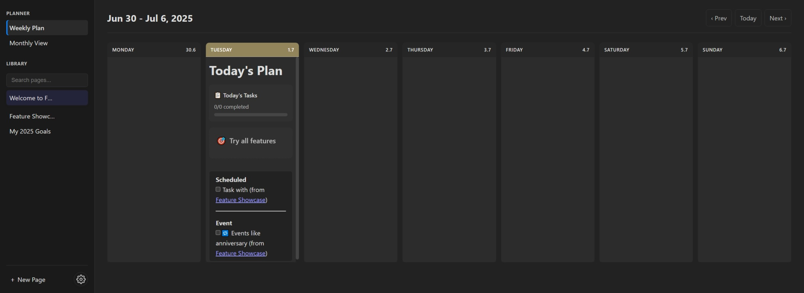

# Focal Journal 🎯

A minimalist, local-first digital bullet journal and planner. Organize your tasks, notes, goals, habits, moods, finances, books, and movies—all in your browser, with optional secure cloud sync.



## ✨ Features

- **Weekly & Monthly Planner:** Plan your week and month with flexible, markdown-powered entries.
- **Task Management:** Create and track tasks with checkboxes and summaries.
- **Goal Tracking:** Set goals, track progress, and visualize achievements.
- **Habit Tracker:** Build routines, set targets, track streaks, and earn rewards.
- **Mood Tracker:** Log daily moods and visualize patterns (calendar, chart, circular).
- **Finance Tracker:** Track income/expenses, categorize transactions, and view charts.
- **Book Tracker:** Manage your reading list, progress, and stats (Google Books integration).
- **Movie Tracker:** Build your watchlist, track watched/favorites (TMDB integration).
- **Wiki-Style Notes:** Use `[[links]]` to connect pages and build a personal knowledge base.
- **Push Notifications:** Set reminders for tasks and events.
- **Local-First & Private:** All data is stored in your browser by default.
- **Cloud Sync (Optional):** Securely sync across devices with Firebase.
- **Customizable Themes:** Choose from multiple light/dark themes.
- **Keyboard Shortcuts:** Designed for fast, keyboard-first navigation.

## 🛠️ Technology

- **Frontend:** HTML5, CSS3, Vanilla JavaScript (ES6+)
- **Cloud:** Firebase (Auth, Firestore, Messaging)
- **Libraries:** date-fns, marked.js, Feather Icons
- **Storage:** Browser `localStorage` (default), Firebase (optional)

## 📚 Markdown Extensions

Focal extends Markdown for rich planning:

- `[[Page Title]]` — Wiki-style links and backlinks
- `GOAL: ...` — Define and track goals
- `TASKS: ...` — Task summary blocks
- `HABITS: define` — Habit definitions with categories, goals, targets, and achievements
- `HABITS: today|grid|stats|chart|categories|goals|achievements` — Habit widgets
- `MOOD: calendar|chart|circular, emoji|color|all, YYYY-MM-DD:mood` — Mood widgets
- `FINANCE: summary|chart|chartpie, USD, this-month` — Finance widgets
- `BOOKS: full-tracker|to-read|stats|...` — Book widgets
- `MOVIES: watchlist|watched|favorites|stats|...` — Movie widgets
- `(SCHEDULED: YYYY-MM-DD)` — Schedule tasks/events
- `(REPEAT: ...)` — Recurring events
- `(NOTIFY: YYYY-MM-DD HH:mm)` — Push notifications

## 🚀 Getting Started

1. **Clone the repository:**
   ```bash
   git clone https://github.com/Lunedor/Focal.git
   ```
2. **Navigate to the directory:**
   ```bash
   cd Focal
   ```
3. **Open index.html in your browser.**

> For Google Sign-In and Cloud Sync, use a local server (e.g., VS Code Live Server or `python -m http.server`).

## 📝 Example Usage

```
# From within the project directory
python -m http.server
# Or for Python 2
# python -m SimpleHTTPServer
```

Now you can access the app at http://localhost:8000.

---

📜 License
This project is licensed under the MIT License.

---

Created by Lunedor. For more, see the Screenshots and sample data in sampleData.js.
